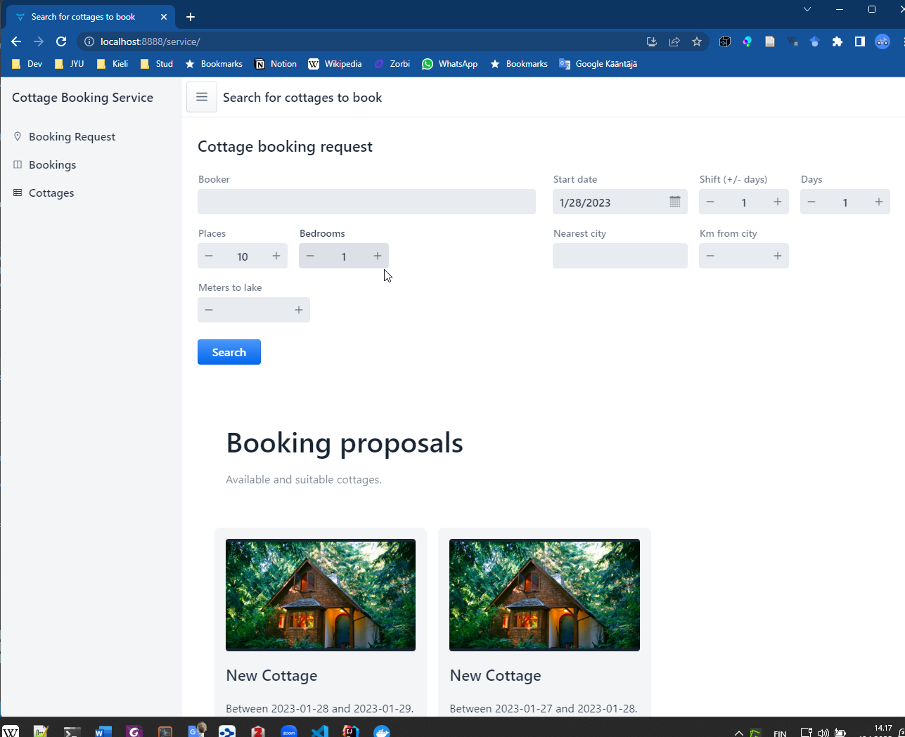
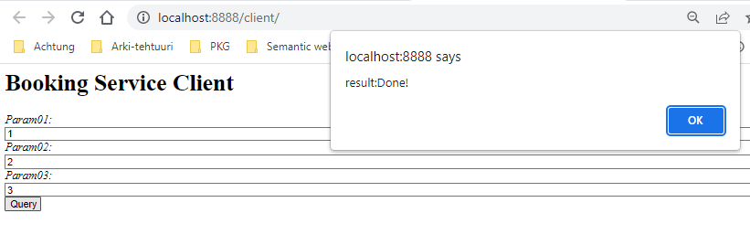
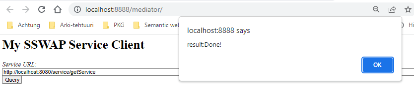
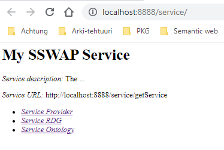

# Tasks of Course: Semantic Technologies for Developers (TIES4520)

* School: University of Jyväskylä
* Lecturer: Dr. Oleksiy Khriyenko
* Student: Béla Borbély

## Tasks

* [Task 3](tasks/task3.md) - Basics of OWL and RDFS
* [Task 4](tasks/task4.md) - Reasoning with CWM ([Dockerfile available](tasks/task4/Dockerfile)) and SWRL, Protégé 
* [Task 5](tasks/task5.md) - Annotating html content, JSON-LD
* [Semi-final assignment](tasks/semiFinal.md) - missing answers
* [Task 6](tasks/task6.md) - Basic Java Web application (built with [Vaadin Starter](https://start.vaadin.com/app)) with OWL-ontology (using [Apache Jena](https://jena.apache.org/) libraries) running in Tomcat 9 with JDK11 ([Dockerfile available](tasks/task6/Dockerfile))
* [Task 7](tasks/task7.md) - missing answers
* [Task 8](tasks/task8.md) - missing answers

## Template Projects for Tasks 6, 7 and 8

* [All in one Maven project](templateProjects/pom.xml) - ([Dockerfile available](templateProjects/Dockerfile)) -  Basic Java Web application with OWL-ontology running in Tomcat 9 with JDK11. Also a modified Maven-aware version of SSWAP, ported from https://sourceforge.net/p/sswap/code/HEAD/tree/API-SDK/. Not tested fully only for basic running of Task.
* [Installed application in Azure](https://semantiweb-cottagebooking.azurewebsites.net/ui/) - Outdated

### Maven-help

* [Maven: What is the POM? POM stands for "Project Object Model".](https://maven.apache.org/pom.html#what-is-the-pom)

Maven builds should take 5-15 min at the first time. 

## Building and Running Tasks in Docker

> Get repository with git and change to directory root.

````bash 
git clone https://github.com/belaborbely-jyu/ties4520.git
````

### Task 4

> Build a small Docker-image with tag task4. Image is based on latest ubuntu image and installing Python 2 and copying CWM from sources to image.

````bash
docker build tasks/task4 --tag task4
cd ties4520
````

> Launch a Docker container from image with tag task4. Start bash and run CWM.

````bash
docker run -ti -rm task4 bash
python2 cwm --help
````

> Press 'exit' to quit bash and stop running Docker container. Container will be removed (-rm options).

### Task 6

Build and run takes 10-15 min and creates quite big image 1.5 Gb because of Tomcat and Vaadin additional sources. 

Tomcat in preconfigured using port 8080 inside the container.
On desktop it is channelled to port:8888. This port:8888 should be free.
Otherwise you have to be changed in quite many place in code (SPARQL-templates, OWL-ontology and RDF-knowledge base). A "search-replace" method should work in this change.

> Build a Java Web Application as Maven project in run a Docker Container with Tomcat Server Container. 

````bash
docker build tasks/task6 --tag task6
docker run -it --rm -p 8888:8080 task6
````

> Open browser with address [http://localhost:8888/service/](http://localhost:8888/service/).



> Press CTRL+C to stop running Docker container. Container will be removed (-rm options).

### Building and Running Template Projects in Docker

````bash
docker build templateProjects --tag ties4520-template
docker run -it --rm -p 8888:8080 ties4520-template
````

> Go to web browser and open http://localhost:8888/client/. 



This context is for Task 6. Source can be found: [/templateProjects/SW_project/](/templateProjects/SW_project/). 

The SSWAP-ported source code can be founf here: [/templateProjects/SSWAP_example/SSWAP/](/templateProjects/SSWAP_example/SSWAP/).

> Go to web browser and open http://localhost:8888/mediator/. 



This context is for the Mediator-client for Task 7. Source can be found: [/templateProjects/SSWAP_example/SSWAP_Client/](/templateProjects/SSWAP_example/SSWAP_Client/). Should use address for form "http://localhost:8080/service/getService"

> Go to web browser and open http://localhost:8888/service/.



This context is for the original service for Task 7. Logically quite same as the SW_project for Task 6, but configured for SSWAP-communication. Source can be found here: [/templateProjects/SSWAP_example/SSWAP_Service/](/templateProjects/SSWAP_example/SSWAP_Service/).

> Press CTRL+C to stop running Docker container. Container will be removed (-rm options).