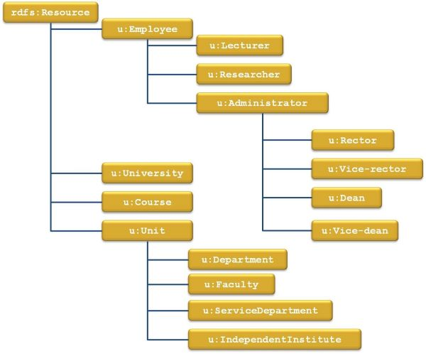
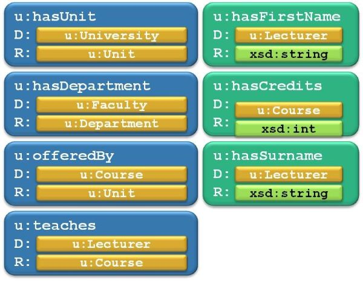

# Task 3

The original [Word document](https://jyu-my.sharepoint.com/:w:/g/personal/borbely_jyu_fi/ERZKKW9RUgpDpbecVyQ0LmABozCcR48QDAaEp3-UGRl_bg?e=8vO0c5) with the answers.

## Task 3-1

> Convert the graphical representation below of the TBox part of an ontology to text in Turtle notation using RDF Schema as the ontology language.



Properties (no hierarchy, all at the same level):



Solution in Turtle:
```turtle
@prefix u: <http://www.jyu.fi/ontology#> .
@prefix rdf: <http://www.w3.org/1999/02/22-rdf-syntax-ns#> .
@prefix rdfs: <http://www.w3.org/2000/01/rdf-schema#> .
@prefix xsd: <http://www.w3.org/2001/XMLSchema#> .

# Classes
rdfs:Resource a rdfs:Class .
u:University a rdfs:Class .
u:Course a rdfs:Class .
u:Unit a rdfs:Class .
u:Department a rdfs:Class ; rdfs:subClassOf u:Unit .
u:Faculty a rdfs:Class ; rdfs:subClassOf u:Unit .
u:ServiceDepartment a rdfs:Class ; rdfs:subClassOf u:Unit .
u:IndependentInstitute a rdfs:Class ; rdfs:subClassOf u:Unit .
u:Employee a rdfs:Class .
u:Lecturer a rdfs:Class ; rdfs:subClassOf u:Employee .
u:Researcher a rdfs:Class ; rdfs:subClassOf u:Employee .
u:Administrator a rdfs:Class ; rdfs:subClassOf u:Employee .
u:Rector a rdfs:Class ; rdfs:subClassOf u:Administrator .
u:Vice-rector a rdfs:Class ; rdfs:subClassOf u:Administrator .
u:Dean a rdfs:Class ; rdfs:subClassOf u:Administrator .
u:Vice-dean a rdfs:Class ; rdfs:subClassOf u:Administrator .

# Properties
u:hasUnit a rdf:Property ; rdfs:domain u:University ; rdfs:range u:Unit .
u:hasDepartment a rdf:Property ; rdfs:domain u:Faculty ; rdfs:range u:Department .
u:offeredBy a rdf:Property ; rdfs:domain u:Course ; rdfs:range u:Unit .
u:teaches a rdf:Property ; rdfs:domain u:Lecturer ; rdfs:range u:Course .

u:hasCredits a rdf:Property ; rdfs:domain u:Course ; rdfs:range xsd:int .
u:hasFirstName a rdf:Property ; rdfs:domain u:Lecturer ; rdfs:range xsd:String .
u:hasSurname a rdf:Property ; rdfs:domain u:Lecturer ; rdfs:range xsd:String .
```

## Task 3-2

> For each statement decide if it is correct according to the ontology or not. 

Ontology in Turtle:

```Turtle
@prefix z: <http://zoo.com/animalOntology.rdfs#> . 
@prefix rdfs: <http://www.w3.org/2000/01/rdf-schema#> . 
@prefix xsd: <http://www.w3.org/2001/XMLSchema#> . 
@prefix rdf: <http://www.w3.org/1999/02/22-rdf-syntax-ns#> .

#TBox
z:Animal      a               rdfs:Class .
z:Mammal      a               rdfs:Class ;
              rdfs:subClassOf z:Animal .
z:Primate     a               rdfs:Class ;
              rdfs:subClassOf z:Mammal .
z:Bird        a               rdfs:Class ;
              rdfs:subClassOf z:Animal .
z:Fish        a               rdfs:Class ;
              rdfs:subClassOf z:Animal .

z:hasWingSpan a               rdf:Property ;
              rdfs:domain     z:Bird ;
              rdfs:range      xsd:float .
z:hasFingers  a               rdf:Property ;
              rdfs:domain     z:Mammal ;
              rdfs:range      xsd:int .
z:hasLatinName a              rdf:Property ;
              rdfs:domain     z:Animal ;
              rdfs:range      xsd:string .
z:eats        a               rdf:Property ;
              rdfs:domain     z:Animal ;
              rdfs:range      z:Animal .

# ABox
z:eagle a z:Bird .
z:elephant a z:Mammal .
z:dolphin a z:Mammal .
z:homoSapiens a z:Mammal .

#z:eagle z:hasLatinName "Aquila chrysaetos" .
#z:dolphin z:hasLatinName "15.3"^^xsd:float .
#z:eagle z:eats z:dolphin .
#z:eagle z:hasWingSpan "4.3"^^xsd:int .
#z:homoSapiens z:hasFingers "5"^^xsd:int .
#z:eagle z:hasFingers "3"^^xsd:int .
#z:eagle z:hasWingSpan "5000"^^xsd:float .
#z:elephant z:hasFingers "8"^^xsd:int .
```

Statements:

| Statement | Correct | Incorrect |
| --- | --- | --- |
|z:eagle z:hasLatinName "Aquila chrysaetos" |X||
|z:dolphin z:hasLatinName "15.3"^^xsd:float	||X|
|z:eagle z:eats z:dolphin|X||
|z:eagle z:hasWingSpan "4.3"^^xsd:int||X|
|z:homoSapiens z:hasFingers "5"^^xsd:int|X||	
|z:eagle z:hasFingers "3"^^xsd:int||X|
|z:eagle z:hasWingSpan "5000"^^xsd:float|X||	
|z:elephant z:hasFingers "8"^^xsd:int|X||	

## Task 3-3: 

> Write an ontology using RDF Schema.
   
The ontology should contain:
* at least 5 classes,
* at least 4 properties in the ontology,
* at least 2 class-subclass relationships.

Ontology in Turtle:

```Turtle
@prefix rdf: <http://www.w3.org/1999/02/22-rdf-syntax-ns#> .
@prefix rdfs: <http://www.w3.org/2000/01/rdf-schema#> .
@prefix xsd: <http://www.w3.org/2001/XMLSchema#> .
@prefix todo: <http://www.todo-application.com/ontology/> .

todo:Action rdf:type rdfs:Class .
todo:Step rdfs:subClassOf todo:Action .
todo:Project rdfs:subClassOf todo:Action .
todo:Task rdfs:subClassOf todo:Action .
todo:Phase rdfs:subClassOf todo:Action .

todo:title rdf:type rdf:Property ;
            rdfs:domain todo:Action ;
            rdfs:range xsd:string .

todo:description rdf:type rdf:Property ;
            rdfs:domain todo:Action ;
            rdfs:range xsd:string .

todo:due_date rdf:type rdf:Property ;
            rdfs:domain todo:Action ;
            rdfs:range xsd:date .

todo:is_completed rdf:type rdf:Property ;
            rdfs:domain todo:Action ;
            rdfs:range xsd:boolean .

todo:priority rdf:type rdf:Property ;
            rdfs:domain todo:Action ;
            rdfs:range xsd:string .

todo:steps rdf:type rdf:Property ;
            rdfs:domain todo:Project ;
            rdfs:range todo:Step .

todo:parent_project rdf:type rdf:Property ;
            rdfs:domain todo:Task ;
            rdfs:range todo:Project .

todo:phases rdf:type rdf:Property ;
            rdfs:domain todo:Project ;
            rdfs:range todo:Phase .

todo:tasks rdf:type rdf:Property ;
            rdfs:domain todo:Phase ;
            rdfs:range todo:Task .
```

## Task 3-4

> Create an ontology using Protégé 5.x and save in Turtle format.

* At least 15 classes in total
  * At least one class defined as enumeration of its individuals
  * At least one class defined using property cardinality restrictions
  * At least one class defined using property range restrictions
  * At least one class defined as a union of classes
  * At least one class defined as an intersection of classes
  * At least one class defined as a complement of some class
* At least 5 object properties in total
* At least 5 datatype properties in total
* The ontology must be consistent

[myOntology.owl](task3/myOntology.owl)

## Task 3-5

> Annotate at least 5 individuals (provide an ABox as a simple RDF file with resource description) using concepts from the ontology (define relations between individuals). 
> Save these 5 or more individuals with their relations in Turtle notation into and name the file individuals.rdf

[individuals.rdf](task3/individuals.rdf)

## Task 3-6

> Copy file with ontology (myOntology.owl) and rename it to myOntology_and_Individuals.owl Open it in a text editor and imbed previously created individuals from individuals.rdf into it. 

[myOntology_and_Individuals.owl](task3/myOntology_and_Individuals.owl)