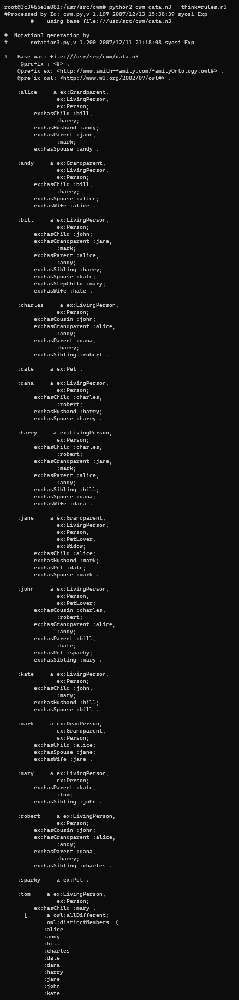
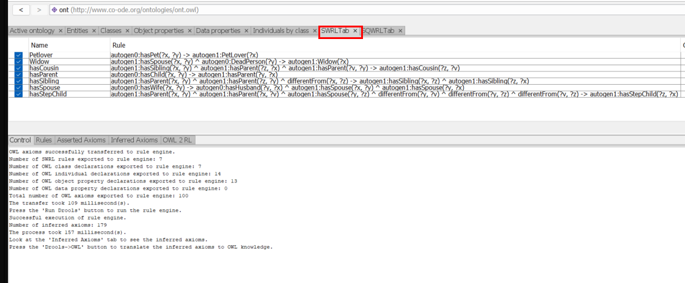
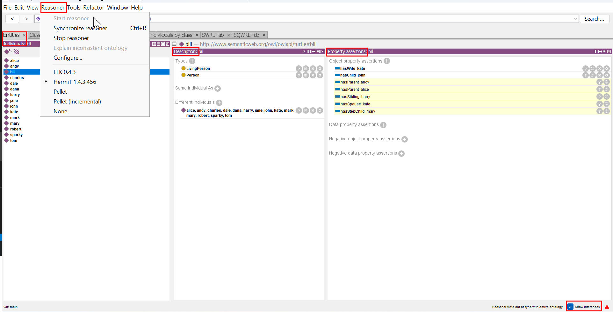

# Task 4: Reasoning

The original [Word document](https://jyu-my.sharepoint.com/:w:/g/personal/borbely_jyu_fi/EdENuQqebvNJj4S4WxGxM24BXjgfXpWvgvO6uoWy8AoIZg?e=pXu7Vr) with the answers.

## Task 4-1

> Prepare CWM environment.

[Docker-file for CWM](task4/Dockerfile)

Build a Docker image with Python2 based on Ubuntu with name task4:
```bash
docker build .   --tag task4
```
Start a Docker-container with task4-image (remove container after stop):

```bash
docker run --rm --name task4 -it task4 bash 
```

Run CWM with python2 command:

```bash
python2 cwm --help
exit
```

## Task 4-2

> Create rules in both languages (Notation3 and SWRL).

To use differentFrom property in rules should be add explicitly using owl:AllDifferent property.

CWM:

``` notation3
_:individuals a owl:allDifferent; owl:distinctMembers(:alice :andy :bill :charles :dale :dana :harry :jane :john :kate :mark :mary :robert :sparky).
```

Protégé:

``` turtle
[ rdf:type owl:AllDifferent ;
  owl:distinctMembers ( :alice
                        :andy
                        :bill
                        :charles
                        :dale
                        :dana
                        :harry
                        :jane
                        :john
                        :kate
                        :mark
                        :mary
                        :robert
                        :sparky
                        <https://mypage.me/myOntologies/myOntology.owl#tom>
                      )
] .
```

Ontology (TBox):
- [In turtle format: tasks/task4/cwm/family.owl](task4/cwm/family.owl)

Data (ABox):
- [In notation3-format for CWM: tasks/task4/cwm/data.n3](task4/cwm/data.n3)
- [In turtle-format for Protégé: tasks/task4/cwm/data.owl](task4/cwm/data.owl)

Builtins:
- [CWM](http://www.w3.org/2000/10/swap/doc/CwmBuiltins)
- [SWRL](http://www.daml.org/rules/proposal/builtins.html#8.1)


All rules in one file:
- [In notation3-format for CWM: tasks/task4/cwm/rules.n3](task4/cwm/rules.n3)
- [In turtle-format for Protégé: tasks/task4/cwm/rules.srwl](task4/cwm/rules.srwl)

### Example: Parent

```notation3
{ ?x ex:hasChild ?y } => { ?y ex:hasParent ?x } .
```

```swrl
hasChild(?x, ?y) -> hasParent(?y, ?x)
```

### Rule 1: Widow

> An individual belongs to class ex:Widow if and only if that individual has a husband that is dead. 
> Having husband is expressed using property ex:hasHusband. 
> Dead person is a person that belongs to class ex:DeadPerson. 
> Make a rule that annotates all widows.

#### CWM

```notation3
{ ?x ex:hasWife ?y } => { ?y ex:hasHusband ?x . ?x ex:hasSpouse ?y . ?y ex:hasSpouse ?x } .
{ ?x ex:hasSpouse ?y . ?y a ex:DeadPerson } => { ?x a ex:Widow } .
```

#### SWRL

```swrl
hasWife(?x, ?y) -> hasHusband(?y, ?x) ^ hasSpouse(?x, ?y) ^ hasSpouse(?y, ?x)
hasSpouse(?x, ?y) ^ DeadPerson(?y) -> Widow(?x)
```

### Rule 2: Petlover

> An individual belongs to class ex:PetLover if and only if that individual has a pet. 
> Having a pet is expressed using property ex:hasPet. 
> Make a rule that annotates all pet lovers.

#### CWM

```notation3
{ ?x ex:hasPet ?y } => { ?x a ex:PetLover } .
```

#### SWRL

```swrl
hasPet(?x, ?y) -> PetLover(?x)
```

### Rule 3: Grandparent

> An individual belongs to class ex:Grandparent if and only if that individual has a child that has a child. 
> Having a child is expressed using property ex:hasChild. 
> Make a rule that annotates all grandparents.

#### CWM

```notation3
{ ?x ex:hasParent ?y . ?y ex:hasParent ?z } => {?x ex:hasGrandparent ?z . ?z a ex:Grandparent } .
```

#### SWRL

```swrl
hasParent(?x, ?y) ^ hasParent(?y, ?z) -> hasGrandparent(?x, ?z) ^ Grandparent(?z)
```

### Rule 4: Cousin

> Connect all cousins with property ex:hasCousin.

Added a generalized property hasSibling for having brother or sister. 

#### CWM

```notation3
{ ?x ex:hasParent ?y . ?z ex:hasParent ?y . ?x log:notEqualTo ?z } => { ?x ex:hasSibling ?z . ?z ex:hasSibling ?x } .
{ ?x ex:hasSibling ?y . ?z ex:hasParent ?x . ?v ex:hasParent ?y } => { ?z ex:hasCousin ?v } .
```

#### SWRL

```swrl
hasParent(?x, ?y) ^ hasParent(?z, ?y) ^ differentFrom(?x, ?z) -> hasSibling(?x, ?z) ^ hasSibling(?z, ?x)
hasSibling(?x, ?y) ^ hasParent(?z, ?x) ^ hasParent(?v, ?y) -> hasCousin(?z, ?v)
```

### Rule 5: Stepchild

> In case a person does not have a connection via ex:hasChild property to the individual that is connected via the same property with a spouse of that person (wife or husband), then build a connection between the person and individual via ex:hasStepchild property. 

There should be set both parent for a child being able to know if she or he a step child of a parent. 

#### CWM

```notation3
{ ?x ex:hasParent ?y . ?x ex:hasParent ?v . ?y ex:hasSpouse ?z . ?y  log:notEqualTo ?v . ?y log:notEqualTo ?z . ?v log:notEqualTo ?z }  => { ?z ex:hasStepChild ?x } .
```

#### SWRL

```swrl
hasParent(?x, ?y) ^ hasParent(?x, ?v) ^ hasSpouse(?y, ?z) ^ differentFrom(?y, ?v) ^ differentFrom(?y, ?z) ^ differentFrom(?v, ?z) -> hasStepChild(?z, ?x)
```

## Results

### CWM

Start a Docker-container with task4-image (remove container after stop):

```bash
docker run --rm --name task4 -it task4 bash 
```
Run CWM with python2 command:

```bash
python2 cwm data.n3 helper_rules.n3 --think --filter=rule1.n3
python2 cwm data.n3 helper_rules.n3 --think --filter=rule2.n3
python2 cwm data.n3 helper_rules.n3 --think --filter=rule3.n3
python2 cwm data.n3 helper_rules.n3 --think --filter=rule4.n3
python2 cwm data.n3 helper_rules.n3 --think --filter=rule5.n3
exit
```



### Protégé

Add rules manually in Rules Tab:



Start reasoner from Program-menu. Check option at the right bottom of Program-window: "Show inferences":

