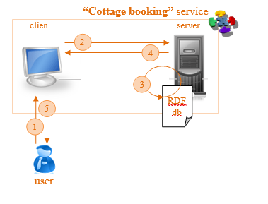

# Task 6 

The original [Word document](https://jyu-my.sharepoint.com/:w:/g/personal/borbely_jyu_fi/EWis2Mfxl21PqTltjJLvNVYBhfhk9lPRkYq8lqEpjB0rPQ?e=JfX8AB) with the answers.

Develop simple “Cottage booking” service to be run on Apache Tomcat server. Service should perform a search in a database of the cottages and return a set of bookings for the cottages that fit the requirements set as input to the service. Service uses RDF file as a database with a set of instances (at least 5) that describes some cottages (cottage configurations). This file should be located inside .war package of the service.

Service searches and provides a result based on following information:
*	name of the booker;
*	required number of places (people);
*	required number of bedrooms;
*	max distance of a cottage from a lake (meters);
*	city (next to which cottage is located) and a max distance to that city from a cottage;
*	required number of days;
*	starting day of a booking (dd.mm.yyyy) and max possible shift of it (+/- n days).

Service returns a set of possible bookings/offers (that match submitted booking request) with following information:  
*	name of the booker;
*	booking number;
*	address of the cottage;
*	image of the cottage (URL of the image in the web);
*	actual number of places in the cottage;
*	actual number of bedrooms in the cottage;
*	actual distance to the lake (meters);
*	nearest city and a distance to it from the cottage;
*	booking period.   

## “Cottage booking” service logic:

1.	user fills all the input information required by client webpage;
2.	client submits the input data to the server part (backend) of the service;
3.	server performs corresponding search procedure in the local database (RDF file in our case);
4.	server sends output information back to the client;
5.	client updates the interface and represents output of the service to the user (list of suitable bookings/offers with corresponding cottages descriptions).

To support this service, you need to create correspondent domain ontology(ies):
*	each group makes own ontology(ies);
*	ontology(ies) should be located inside .war package of the service;
*	be sure that URI(s) of ontology(ies) points to the real location (e.g. localhost:8080/exampleService/onto/exampleOntology.owl);

## Result:

Provide the result of this Task as an archive of the following files:
*	this document; 
*	OWL file(s) with domain ontology(ies): [ontology.ttl](task6/Service/src/main/webapp/ontology.ttl);
*	RDF file in Turtle (n3) notation with data about the cottages (your Cottage database): [BookingDB.ttl](task6/Service/src/main/webapp/BookingDB.ttl);
*	WAR file and source code of the “Cottage booking” service.
