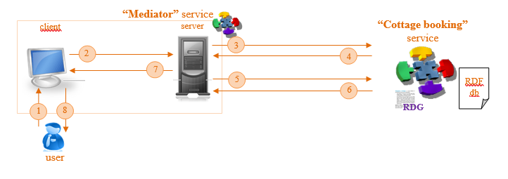

# Task 7

The original [Word document](https://jyu-my.sharepoint.com/:w:/g/personal/borbely_jyu_fi/EXG4oGDyjf5MnrsHElIyMO4B1VQRI0ZHJ6fwSHLR0p4BBw?e=vAHXPe) with the answers.

Based on the “Cottage booking” service developed in Task 6, develop simple (sswap) “Cottage booking” service that will be used by other services. Service should perform the same search functionality of the cottages and return a set of bookings for the cottages that meet the requirements sent by input to the service. Additionally, you should use sswap ontology to create RDG of the “Cottage booking” service. 

Create “Mediator” service (to be run on Apache Tomcat server) to communicate with “Cottage booking” service. “Mediator” service should collect input data from the user, submit a request to the remote service (“Cottage booking” service) and present the result to the client. Use the same front-end to collect input data from the user and present the results.  
Client part of the “Mediator” service should have human interface that contains 3 areas:
*	area to enter URL of remote service (“Cottage booking” service) and request service description;
*	area to collect and submit the service input information;
*	area to represent the service output.
Server part (backend) of the “Mediator” service should communicate with the client part (frontend) and with the remote service located at service URL received from the client.

## “Mediator” service logic:

1.	client provides the form to collect input information from the user. User fills all the input information as well as provides URL of a remote service;
2.	client (frontend) sends all data provided by user to the server (backend);
3.	server sends GET request to the URL of the remote service;
4.	server receives service description (RDG) from the remote service;
5.	server parses this description, creates service request (RIG) based of the input data received from the client and POSTs it to invoke the remote service;
6.	server receives the remote service response (RRG);
7.	server parses it and send output information to the client;
8.	client updates the interface and represents output of the remote service to the user.

To support transformation of the “Cottage booking” service developed in Task 6 into a sswap “Cottage booking” service, you might need to extend previously created domain ontology(ies) or create some extra ontology(ies):
*	each group makes own ontology(ies);
*	ontology(ies) should be located inside .war package of the service;
*	be sure that URI(s) of ontology(ies) points to the real location (e.g. localhost:8080/exampleService/onto/exampleOntology.owl);
*	Please notice that concepts (classes, properties) used for cottage description and concepts that describe search request/response might not be the same.

## Result:

Provide the result of this Task as an archive of the following files:
•	this document; 
•	OWL file(s) with domain ontology(ies);
•	RDF file in Turtle (n3) notation with data about the cottages (Cottage database);
•	RDF files in Turtle (n3) notation with “Cottage booking” service description (RDG) and an example of invocation (RIG) and response (RRG) graphs;
•	WAR file and source code of the “Cottage booking” service;
•	WAR file and source code of the “Mediator” service.

Ontology, RDG, RIG and RRG related aspects will be processed during the Demo-6. Therefore, send the RDF files in Turtle (n3) notation with “Cottage booking” service RDG, RIG and RRG, as well as corresponding Ontology(ies) to lecturer (oleksiy . khriyenko @ jyu . fi) before the deadline (end of 17.11.2022).
