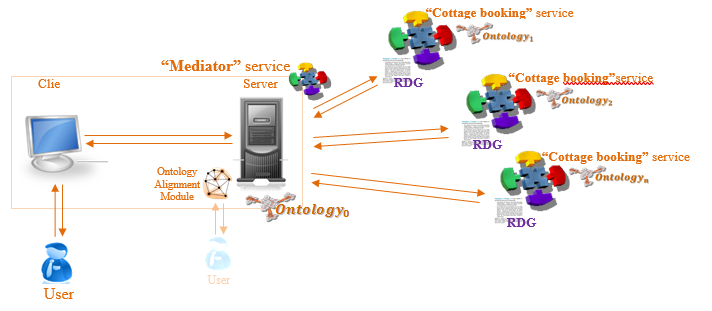

# Task 8

The original [Word document](https://jyu-my.sharepoint.com/:w:/g/personal/borbely_jyu_fi/ES3-Ize5-B5JtV4cqSirh1QBXuuhl92NgQqTkHVOveP5gA?e=Q4qVBs) with the answers.

## Run-time Ontology Alignment 

As a result of the Task 7, you already have “Mediator” service that allows user to use remote “Cottage booking” service. Assuming that there are several other “Cottage booking” services exist, your “Mediator” service should be able to communicate with them as well. Due to the fact that all of those “Cottage booking” services are SSWAP services and are based on the same services description and communication protocol, there is no problem for “Mediator” service to access and interact with them. The problem might occur on semantic level, due to the difference of domain ontologies used by these “Cottage booking” services.         
If implementation of your Client’s interface is bound to certain ontology (e.g. domain ontology of your “Cottage booking” service), then it might not properly work with other domain ontologies of other “Cottage booking” services. Therefore, you have to map all other ontologies to the ontology your Client supports.  

So, the goal of the Task 8 is to make your “Mediator” service able to work with other remote “Cottage booking” services (developed by other teams). You need to extend functionality of the Server part (back-end) of your “Mediator” service with ontology alignment module. Every time when “Mediator” service connects to new remote service and gets correspondent RDG (as well as getting RRG with the service result), ontology alignment module should build appropriate alignment to be used for further data transformation. Save every alignment to a separate file. You should implement two alignment methods: your own method (single similarity measuring function or combination of several, e.g. one per group member) and method that uses any available open source packages (e.g. AlignmentAPI, but other packages are preferable). Considering that alignment might not be done automatically with 100% precision, human support might be needed. So, alignment module should provide human interface to confirm automatically created alignment or, whenever a confidence level is lower than certain threshold (you may set the threshold yourself), to manually specify required mapping.     

To be able to show the result, every team should create a separate “fake” remote service that will imitate the work of “Cottage booking” services of other teams. Such service should have two local RDF files (RDG.rdf, and RRG.rdf provided by other groups) and send the content of these files accordingly to the communication logic of SSWAP “Cottage booking” service. Domain ontologies, RDG descriptions and examples of RIG and RRG files of the “Cottage booking” services of other teams will be available at the course website (http://users.jyu.fi/~olkhriye/ties4520/) as extra materials for the Task 8, or could be exchanged between groups via course mailing list. 

## Task-8 Result:

Result for this task should include the whole solution for the Task-8 that is described above. “Mediator” services should be extended with ontology alignment module (including implementation of own similarity measuring function(s) as well as use of some other open-source package(s) (e.g. AlignmentAPI, but other packages are olso preferable)) and be able to interact with “fake” remote service(s).

At the same time, prepare short presentation (PowerPoint file) describing your alignment solution (including graphical representation of own “Cottage booking” service domain ontology(ies) and ontology(ies) of other group(s), as well as similarity measuring function(s) you have used in your solution). Short comparative analysis of own alignment method and third party package solution should be included to the presentation.

Teams might also agree about joined presentation of the results, showing interaction between real “Cottage booking” services of each other instead of “fake” service use. It is not obligatory, but might bring some extra bonuses for the teams’ members. 

Result is going to be present during the Demo-8 (09.12.2022). Be sure that you have everything prepared on your computer to show the result (considering connection to the projector). All other teams should be ready for discussions.   

Provide the result of this Task as an archive of the following files:
*	this document;
*	PowerPoint  file with presentation;
*	WAR file and source code of “fake” service.
*	WAR file and source code of improved “Mediator” service.
